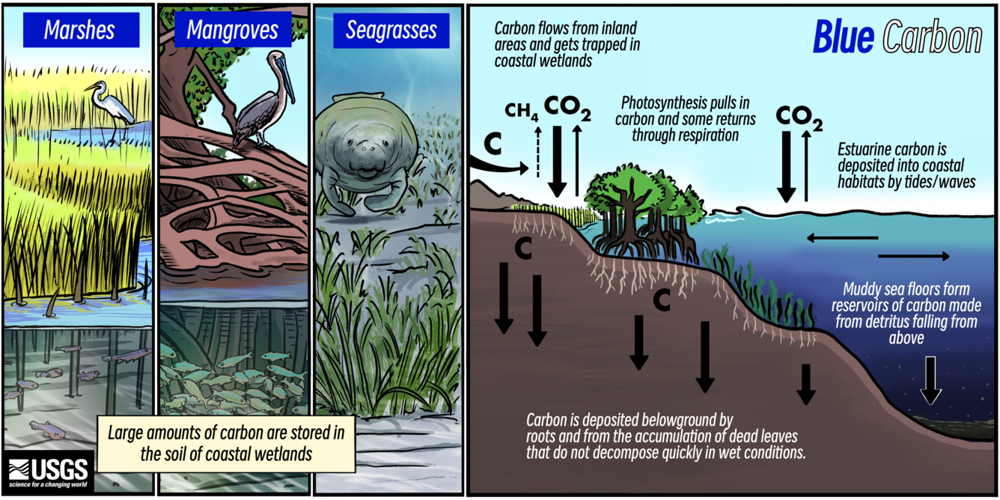
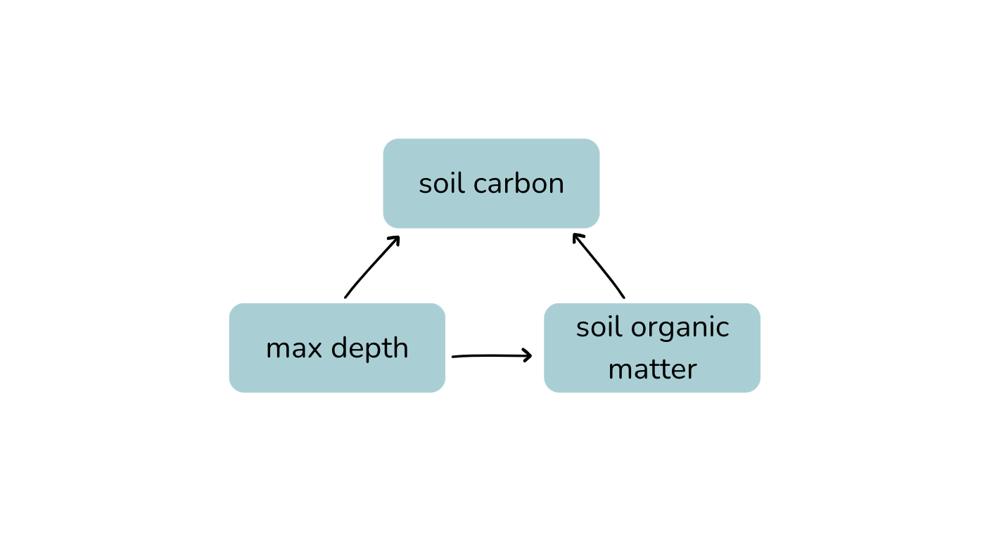

## Research Question
Large amounts of carbon is naturally stored in the world's oceans and in the soil of coastal wetlands. This is referred to as *blue carbon*. 
 
Blue carbon is unique due to its ability to store or sequester carbon at a much faster rate than terrestrial ecosystems like forests. This carbon is stored in the soils of these ecosystems -- marsh, sea grass, mangrove, salt marshes. These habitats are of growing interest as greenhouse gases continue to accumulate in the atmosphere. Understanding the biogeochemical processes that make up carbon sequestration is important for advancing blue carbon management as a solution to climate change.  (@USGS_BlueCarbon_2024). 



For this project, I will fit a **Beta Regression** model to answer the
following question:

-   **How does soil organic matter affect carbon in coastal ecosystems?**

Soil organic matter is the organic matter within the soil that is deposited from organisms at various stages of decomposition. Soil organic matter is a key indicator of soil carbon in an ecosystem. Soil carbon is the fraction of carbon within the soil organic matter. 

## Data Background

This data is from the Smithsonian Environmental Research Center Coastal Carbon Network (@SERC_CoastalCarbon). The CCN collects and standardizes carbon stock and flux data from coastal ecosystems worldwide. They provide access to data sets for researchers and students like me. The dataset itself is originally over 15,000,000 observations. It includes data on soil measurements such as depth of soil cores, soil bulk density, organic matter, carbon, and data on habitat and associated vegetation. 

{fig-align="center" width="10%"}

## Data wrangling
In this section I filtered the data for only variables of interest (`fraction_carbon`, `fraction_organic_matter`, `max_depth`, `habitat`) as well as ensured that `fraction_carbon` only contained fractional data between 0 and 1. For this dataset, I also filtered to the three most researched habitats for blue carbon: mangrove, seagrass, and marsh.
```{r}
#| label: library set-up 
#| output: false 
#| echo: false

set.seed(123)

library(tidyverse)
library(here)
library(dplyr)
library(ggplot2)
library(kableExtra)
# For statistical analysis
#install.packages("glmmTMB")  
library(glmmTMB)
library(paletteer)

```

```{r}
#| label: data import 
#| output: false 

# Import 'CCN_sites', 'CCN_species', 'CCN_cores', 'CCN_depth_series'

sites <- read_csv(here("CCN_data/CCN_sites.csv"))
species <- read_csv(here("CCN_data/CCN_species.csv"))
cores <- read_csv(here("CCN_data/CCN_cores.csv"))
depth_series <- read_csv(here("CCN_data/CCN_depthseries.csv"))

```

```{r}
#| label: data wrangling
#| output: false
#| warning: false 

set.seed(123)

# .....Further filter datasets.....

# species data 
species <- species %>% 
  select('site_id', 'habitat') %>% 
  filter(habitat %in% c("mangrove", "seagrass", "marsh")) %>% 
  drop_na()

# cores data 
cores <- cores %>% 
  select('site_id', 'max_depth') %>% 
  drop_na()

# depth series data 
depth_series <- depth_series %>% 
  select('site_id','fraction_organic_matter', 'fraction_carbon') %>% 
  drop_na()

#.....Join datasets.....

blue_carbon <- species %>% 
  full_join(depth_series, by = c('site_id')) %>% 
  full_join(cores, by =  c('site_id')) 

#.....Random sample....
blue_carbon <- sample_n(blue_carbon, size = 100000)


#.....Remove Negative values from Fraction Carbon.....

# Ensure `fraction_carbon` ranges between 0 and 1 for analysis.
range(blue_carbon$fraction_carbon)

sum(blue_carbon$fraction_carbon < 0, na.rm = TRUE) # 467 negative values. 

# Replace negative numbers wiht NAs
blue_carbon$fraction_carbon[blue_carbon$fraction_carbon < 0] <- NA

# Check range to ensure negative values were 
range(blue_carbon$fraction_carbon)

# Remove Nas from entire dataset
blue_carbon <- na.omit(blue_carbon)

#..... Ensure R keeps data within bounds....
blue_carbon$fraction_carbon[blue_carbon$fraction_carbon == 1] <- .999 
blue_carbon$fraction_carbon[blue_carbon$fraction_carbon == 0] <- .0001

# clear up environment
rm(list = c("cores", "depth_series", "sites", "species"))


table(blue_carbon$habitat)
```

## Data Exploration
In order to understand what analysis needs to be done, some preliminary data exploration is useful. I am particularly interested in the spread of data points for `fraction_carbon`. 
```{r, fig.cap= "Fig 1. Distribution of Fraction Carbon"}
#| label: Data viz 1
#| message: false 
#| code-fold: true

frac_car_plot <- blue_carbon %>% 
  ggplot(aes(fraction_carbon)) +
  geom_histogram(fill = "#9fd0d6") +
  labs(x = "Fraction carbon (dimensionless)", 
       y = "Frequency", 
       title = "Distribution of Fraction Carbon") +
  theme_classic() +
  theme(plot.title = element_text(hjust = 0.5)) # center title 

frac_car_plot

```
As you can in `fig 1.`, fraction carbon is left skewed signifying that it does not follow a normal distribution. This is due to fraction carbon being bounded between 0 and 1 because it is a fraction. 

```{r, fig.cap= "Fig 2. Relationship between soil organic matter and fraction carbon"}
#| label: Data viz 2
#| message: false 
#| code-fold: true

my_palette <- c("#9FD0D6", "#F2A176", "#985D73")

som_car_habitat_plt <- blue_carbon %>% 
  ggplot(aes(x = fraction_organic_matter, y = fraction_carbon, color = habitat)) +
  geom_point(alpha = 0.2) +
  geom_smooth(aes(group = habitat), method = "lm", se = FALSE) +
  scale_color_manual(values = my_palette) +
  theme_classic() +
  labs(x = "Soil Organic Matter (dimensionless)", 
       y = "Fraction carbon (dimensionless)", 
       title = "Relationship between soil organic matter and fraction carbon")

som_car_habitat_plt
```
As you can in `fig 2`, soil organic matter has follows a linear pattern with fraction carbon. 
There is some notable variation between habitat, especially between seagrass and marsh and mangrove habitats, however the shape of the data is similar for the majority of habitats. 

## Statistical model: Beta Regression
Since my response variable, `fraction_carbon` is a fraction between 0
and 1, and is not normally distributed around the mean, I will use *Beta regression* (@CribariNetoZeileis2010). Beta regression models the mean of a proportion or fraction as a function of predictors. My predictors in this study are the following:

- `fraction_organic_matter`: Mass of organic matter relative to sample dry mass (dimensionless)
- `max_ depth`: Maximum depth of a sampling increment (centimeters)

Why include `max_depth` in the model? Deeper soils might have more organic matter
accumulation and fraction carbon can change with depth (e.g., shallower
layers of soil may have higher carbon than deeper layers). 

Why exclude `habitat` from the model? I am interested in the overall relationship between soil organic matter and fraction carbon, regardless of habitat. If I were to represent the causal relationship of habitat on fraction carbon I would represented it habitat → fraction_organic_matter → fraction_carbon. Because habitat influences organic matter, it inhibits the total effect of organic matter on fraction carbon. 

I represented these causal relationships with a DAG (directed acyclic graph): 



### Hypothesis

Question: How does soil organic matter affect carbon?

-   H₀ (null hypothesis): Soil organic matter has no effect on fraction
    carbon in the soil.

-   H₁ (alternative hypothesis): Higher soil organic matter is
    associated with higher fraction carbon.


### Statistical Notation of model
$$
\begin{align}
\text{carbon} &\sim \text{Beta}(\mu, \phi) \\
logit(\mu) &= \beta_0 + \beta_1 \, \text{organicmatter}_i + \beta_2 \, \text{maxdepth}_i
\end{align}
$$ 

- *carbon* is the fraction of carbon, constrained between 0 and 1.
- $\mu_i$ is the expected value of carbon.
- $\phi$ is the precision parameter of the beta distribution. This controls the variance.
- coefficients: $\beta_0$ is the intercept; $\beta_1$ and $\beta_2$ are coefficients for the predictors fraction organic matter and max depth 

## Fit model to simulated data

In order to determine if a Beta regression model is fit for this data, I
will *simulate* data and perform an analysis on the simulated data. This step is also helpful to see how well you understand the model. This includes the following steps:

1. define sample size
2. choose parameters for $\beta$ 
3. define range for predictors: This step is not necessary but helpful in simulating real *fake* data. In this step, I used the `runif()` function
4. define linear equation and logit function
5. generate response
6. fit model to simulated data

```{r}
#| label: Simulated data parameters
#| output: false
#| warning: false
#| message: false 

# set seed for reproducibility
set.seed(123)

# 1. Define sample size
n <- 10000 # large enough

# 2. Choose parameters 
beta_0 <- 0.5 # intercept (fraction carbon)
beta_1 <- 0.8  # effect of fraction organic matter
beta_2 <- -0.01 # effect of max_depth
phi <- 0.9 # precision parameter 

# 3. define predictor ranges (x's)
# runif(n=sample size, min, max)
fraction_organic_matter <- runif(n, 0.05, 0.9)
max_depth <- runif(n, 0, 30)

# 3. Linear predictor and Logit response
  # set logit_mu 
logit_mu <- beta_0 + beta_1 * fraction_organic_matter + beta_2 * max_depth 
  # set transformation 
  # Inverse logit 
mu <- 1 / (1 + exp(-logit_mu)) # mu = mean of beta distribution

# 4. Generate response with rbeta(). Look up documentation.
shape1 <- mu * phi
shape2 <- (1 - mu) * phi
fraction_carbon <- rbeta(n, shape1, shape2)

# R computer error: ensure that fraction carbon stays between 0 and 1
fraction_carbon[fraction_carbon == 1] <- .999 
fraction_carbon[fraction_carbon == 0] <- .0001


# 5. Create dataframe for simulated data
sim_blue_carbon <- data.frame(fraction_carbon, fraction_organic_matter, max_depth)

# 6. Fit model 
betareg_sim_mdl <- glmmTMB(fraction_carbon ~ fraction_organic_matter + max_depth, data = sim_blue_carbon, family = beta_family())

  # Summarize model
summary(betareg_sim_mdl)

```

```{r}
#| label: kable table 
#| echo: false

# Get model summary 
betareg_sim_mdl_sum <- summary(betareg_sim_mdl)

# Extract coefficients from model. glmmTMB stores coefficients differently.

beta_0_sim <- betareg_sim_mdl_sum$coefficients$cond["(Intercept)", "Estimate"]
beta_1_sim <- betareg_sim_mdl_sum$coefficients$cond["fraction_organic_matter", "Estimate"]
beta_2_sim <- betareg_sim_mdl_sum$coefficients$cond["max_depth", "Estimate"]

  
# Turn into table 
coefficients <- c("Intercept", "Fraction Organic Matter", "Max Depth")
estimate_sim <- c(beta_0_sim, beta_1_sim, beta_2_sim)
actual <- c(beta_0, beta_1, beta_2)

# combine into data frame 
sim_df_assess <- data.frame(coefficients, estimate_sim, actual) 

sim_df_assess%>% kable(col.names = c("Coefficient", "Simulation Estimate", "Actual Parameter"), caption = "Table 1. Model Assessment") %>%
  kable_styling(bootstrap_options = "striped", full_width = FALSE)


```
The model seems to recover parameters well. This is good evidence that beta regression is the model for this data. 

## Fit model to real-life data
Now, I will fit a beta regression model to real life data from the Smithsonian's Coastal Carbon Network. I will use the `glmmTMB` package and specify the family as `beta_family` for a beta regression. 
```{r}
#| label: Fit model 

# .....Fit beta regression model..... 

betareg_mdl <- glmmTMB(fraction_carbon ~ fraction_organic_matter + max_depth, 
                      data = blue_carbon, family = beta_family()) 

```

```{r}
#| label: Summarize model
#| code-fold: true

# .....Summarize model.....
betareg_mdl_sum <- summary(betareg_mdl)

# .....Extract coefficients..... 

# beta_0 (intercept)
beta_0 <- betareg_mdl_sum$coefficients$cond["(Intercept)", "Estimate"] 

# beta_1 (slope of reference)
beta_1 <- betareg_mdl_sum$coefficients$cond["fraction_organic_matter", "Estimate"]

# beta_2 (change in intercepts)
beta_2 <- betareg_mdl_sum$coefficients$cond["max_depth", "Estimate"]

# Std. Errors 
error_beta_0 <- betareg_mdl_sum$coefficients$cond["(Intercept)", "Std. Error"] 
error_beta_1 <- betareg_mdl_sum$coefficients$cond["fraction_organic_matter", "Std. Error"] 
error_beta_2 <- betareg_mdl_sum$coefficients$cond["max_depth", "Std. Error"] 

# P-values 
p_beta_0 <- betareg_mdl_sum$coefficients$cond["(Intercept)", "Pr(>|z|)"] 
p_beta_1 <- betareg_mdl_sum$coefficients$cond["fraction_organic_matter", "Pr(>|z|)"] 
p_beta_2 <- betareg_mdl_sum$coefficients$cond["max_depth", "Pr(>|z|)"] 


```


```{r}
#| label: kable table 2
#| echo: false 

# Turn into table 
coefficients <- c("Intercept", "Fraction Organic Matter", "Max Depth")
estimate <- c(beta_0, beta_1, beta_2)
std_errors <- c(error_beta_0, error_beta_1, error_beta_2)
p_values <- c(p_beta_0, p_beta_1, p_beta_2)

# Ensure p-values show the zeros 
p_text <- ifelse(p_values < 2e-16, "< 2e-16", format(p_values, scientific = TRUE))

# turn into dataframe
betareg_mdl_tbl <- data.frame(coefficients, estimate, std_errors, p_values = p_text)

# put in table 
betareg_mdl_tbl %>%
  kable(col.names = c("Coefficient", "Estimate", "Standard Error", "P-Value"), caption = "Table 2. Beta Regression Output") %>%
  kable_styling(bootstrap_options = "striped", full_width = FALSE)

```
## Model interpretation
The beta regression analysis shows a low baseline of fraction carbon in coastal carbon ecosystems when there is no soil organic matter. Soil organic shows a strong, significant positive effect on fraction carbon. As for max depth, there is a very small effect on fraction carbon, however it is not significant enough in this model to definitely say deeper soils have more/less carbon. 

- Effect of fraction organic matter on fraction carbon → significant
- Effect of max depth on fraction carbon → not significant 

*Reject null hypothesis thats oil organic matter has no effect on fraction carbon in the soil* 

## Generate predictions
In this section I will generate predictions to visualize what the relationship will be for new data. This includes the following steps:

1. Create prediction grid/data frame where `fraction_organic_matter` is allowed to vary based on a specified sequence while `max_depth` is held constant (with its mean). 
2. Use my Beta regression model fitted to real-life data (`betareg_mdl`) to generate predictions for `fraction_carbon`. This produces predicted beta-regression means. Ensure this dataframe is in the response space so that it returns values between 0 and 1. 

Why am I holding `max_depth` constant? I want to show how `fraction_carbon` changes with one predictor (`fraction_organic_matter`). This isolates the effect of organic matter on carbon. 

```{r}
#| label: Generate predictions
#| message: false

# .....Create prediction grid.....
pred_grid <- expand_grid(fraction_organic_matter = seq(from = 0, to = 1, by = 0.001)) %>% 
  mutate(max_depth = mean(blue_carbon$max_depth, na.rm = TRUE)) # hold max depth constant 

# ......Generate predictions.....
betareg_grid <- pred_grid %>% 
  mutate(predictions = predict(object = betareg_mdl, # glm
                     newdata = pred_grid, # expand grid data
                     type = "response")) # response link 

```

### Calculate Confidence Intervals
In this section I will calculate the degree of certainty my predictions have using *confidence intervals*. A confidence interval is a range we are confident contains the population parameter.
```{r}
#| label: Calculate confidence intervals
#| message: false

# Bootstrap nrow(blue_carbon)

boot <- map_dfr(1:1000, \(i) {
  # boot strap sample
  boot_sample <- slice_sample(blue_carbon, n = 1000, replace = TRUE) # replace the bootstrap 
  # fit model 
  boot_mdl <- glmmTMB(fraction_carbon ~ fraction_organic_matter + max_depth, #
                      family = beta_family(link = "logit"), 
                      data = boot_sample)
  # add predictions 
  pred_grid %>%
    mutate(predictions = predict(boot_mdl, newdata = pred_grid, type = "response"),
           boot = i)
})

# build confidence interval 
boot_ci <- boot %>% 
  group_by(fraction_organic_matter, max_depth) %>% 
  summarise(
    ci_lwr = quantile(predictions, 0.025),
    ci_upr = quantile(predictions, 0.975)
  )


```

```{r}
#| code-fold: true
#| message: false 
# .....Plot predictions.....


predict_plot <- ggplot() +
  # Predicted line
  geom_line(data = betareg_grid, 
            aes(x = fraction_organic_matter, y = predictions), 
            color = "#345084FF", size = 1) +
  # Confidence Interval 
  geom_ribbon(data = boot_ci, 
              aes(x = fraction_organic_matter, ymin = ci_lwr, ymax = ci_upr), 
              fill = "#9FD0D6", alpha = 0.2) +
  labs(
    x = "Fraction Organic Matter (dimensionless)", 
    y = "Fraction Carbon (dimensionless)", 
    title = "Predicted Fraction Carbon") +
  theme_bw() +
  theme(plot.title = element_text(hjust = 0.5)) # center title 

predict_plot

predict_plot_data <- ggplot() +
  # Predicted line
  geom_line(data = betareg_grid, 
            aes(x = fraction_organic_matter, y = predictions), 
            color = "#345084FF", size = 1) +
  # Confidence Interval 
  geom_ribbon(data = boot_ci, 
              aes(x = fraction_organic_matter, ymin = ci_lwr, ymax = ci_upr), 
              fill = "#9FD0D6", alpha = 0.2) +
  # Original data points
  geom_point(data = blue_carbon, 
             aes(x = fraction_organic_matter, y = fraction_carbon),
             alpha = 0.5, size = 2, color = "#345084FF") +
  labs(
    x = "Fraction Organic Matter (dimensionless)", 
    y = "Fraction Carbon (dimensionless)", 
    title = "Predicted Fraction Carbon with raw data") +
  theme_bw() +
  theme(plot.title = element_text(hjust = 0.5)) # center title 

predict_plot_data

library(patchwork)
predict_plot + predict_plot_data


```
The predicted plot predicts an increase in fraction carbon as organic matter increases. When plotted 

After plotting this data I noticed the level of *noise* or outliers deviating from the linear direction in the data. This noise is due to 


## Conclusion and next steps
Soil organic matter is a known predictor for fraction carbon, as organic matter is the material that directly contributes to fraction carbon. As expected, the results of the beta regression model, showed significance for soil organic matter's effect on fraction carbon. Max depth did not 
- was your hypothesis agreed with 
- discuss the biogeochem that backs up the analysis 
- discuss why max dpeth wasn't significant
- discuss about sampling error for habitats + the messiness/noisnesss of the data set 
- discuss future avenues for this study (looking into isolating the effect of habitat)
- future expansion: use multinomial regression to predict habitat from fraction carbon, and other variables in the data set 

## References

## Github
[To view this analysis, visit Github repository](https://github.com/IsabellaSegarra/coastal-carbon)